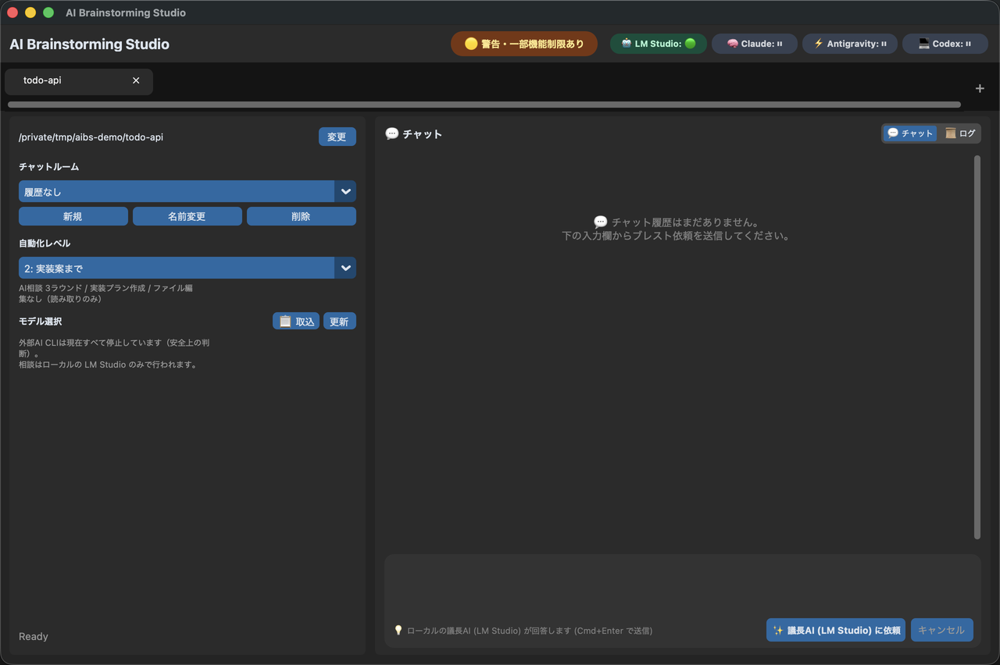

# 🚀 AI Brainstorming Studio (Desktop GUI App)

## ⚠️ このビルドで実際にできること（2026-08-31）

**LM Studio のローカル AI に相談する、読み取り専用のデスクトップ GUI アプリです。**

- **外部 AI CLI（Claude Code / Antigravity / Codex）は起動しません。** 3枠とも停止中です（理由は下記）。
- **AI がプロジェクトのファイルを編集することはありません。** 実装機能は停止しています。
- 相談は LM Studio 単体で行われます。

> **これは「安全なローカル相談版 / 開発プレビュー」であり、正式リリースではありません。**
> 下記「§1 目標とする製品像」に書かれた3社比較・自動実装は、**現時点では動作しません**。将来構想として残しています。



*外部AI CLIの3枠は `⏸`（停止中）と表示されます。障害ではなく、安全上の判断です。*

### ファイル書き込みについて（正確な説明）

AI および外部 CLI は、**対象プロジェクトの既存ファイルを変更しません。**
アプリ自身の会話・セッション記録は、実行時に対象プロジェクト直下の `.ai-brainstorm/` へ保存します。プロジェクトを選択しただけでは書き込みは発生しません。

### 外部 AI CLI が 3 枠とも停止している理由

いずれも「実行ごとに、CLI のカスタマイズ機構を無効化できることを証明できない」ためです。カスタマイズ（hook / MCP / plugin）はモデルのツール制限やシェルサンドボックスの外側で動き、Git 差分にも残りません。

| CLI | 状態 | 理由 |
| --- | --- | --- |
| Claude Code | 停止 | `--safe-mode` で hook 等は無効化できる（実機確認済み）が、**管理者ポリシー(admin-managed)の hook は無効化できない** |
| Antigravity (`agy`) | 停止 | 実行単位で MCP / plugin を無効化するフラグが存在しない（`agy --help` で確認） |
| Codex | 停止 | MCP を実行単位で無効化できない（`-c mcp_servers={}` が効かないことを実測） |

### AI による実装機能が停止している理由

編集を行う CLI プロセスを **OS レベルで隔離する手段がない**ためです。隔離なしに「承認された範囲だけを編集する」と言うのは、境界ではなく主張にすぎません。

`config.IMPLEMENTATION_WRITES_ENABLED = False` で停止しており、**自動化レベルの能力判定・書き込み権限（WriteGrant）の生成・プロセス起動直前**の3箇所で遮断されます。古い設定を読み込んでも、直接呼び出しても、書き込みモードには到達しません。

安全境界の設計と再開条件は `docs/safety-model.md`、現在の構成は `docs/architecture.md`、採用判断は `docs/decisions.md` を参照してください。

---

## セットアップ

### 必要なもの

| | 要件 |
| --- | --- |
| OS | macOS |
| Python | 3.10 以上。`tkinter` が使えること（`python3 -c "import tkinter"` が通る） |
| LM Studio | ローカルサーバを起動できること |

外部AI CLI（Claude Code / Antigravity / Codex）は**このビルドでは不要**です。3枠とも停止しているため、インストールされていなくても動作します。

### 1. LM Studio を準備する

1. [LM Studio](https://lmstudio.ai/) をインストールする
2. モデルをダウンロードする（このアプリは `qwen/qwen3.8-27b` を既定の議長モデルとして想定）
3. **Local Server を起動する**（既定で `http://localhost:1234`）
4. ダウンロードしたモデルを**ロードする**

サーバが未起動の場合、アプリは `lms server start` での自動起動を一度試みます。失敗した場合は状況を表示するだけで、それ以上の操作は行いません。

### 2. 議長モデルを設定する

`src/config.py` の `LM_STUDIO_CHAIR_MODEL` を、**LM Studio が報告するモデルIDと一致させてください。**

```python
LM_STUDIO_CHAIR_MODEL = "qwen/qwen3.8-27b"
```

モデルIDは次で確認できます。

```bash
curl -s http://localhost:1234/v1/models | python3 -m json.tool
```

指定したモデルがロードされていない場合、アプリは**別のモデルで代替せず停止します**（どのモデルが回答したか記録できないため）。`""` を設定するとロード済みのモデルを何でも使いますが、その場合はどのモデルが議長を務めたかを記録できません。

> **推論モデルを使う場合の注意**: `LM_STUDIO_CHAIR_REASONING_EFFORT`（既定 `"none"`）はチューニング設定ではなく、**動作に必要な設定**です。qwen3.8-27b は既定で推論に全トークン予算を使い切り、本文が空のまま返します。アプリはそれを「議長が応答しない」と解釈します。プロンプト内の `/no_think` は効きません。

### 3. インストールと起動

```bash
git clone https://github.com/Noharaman/ai-brainstorming-studio.git
cd ai-brainstorming-studio

python3 -m venv .venv
source .venv/bin/activate
pip install -r requirements.txt

python3 -m src.main
```

### 4. 使う

1. プロジェクトフォルダを選ぶ（**選んだ時点では書き込みません**）
2. 依頼内容を入力する
3. 実行する

結果は「結論 / 採用する方針 / 実行済み / 次にやること / リスク・注意点」の形で返ります。会話とセッション記録は、対象プロジェクト直下の `.ai-brainstorm/` に保存されます。

### テストの実行

```bash
python3 -m unittest discover -s tests
```

GUI統合テストは、`tkinter` が利用できない環境では安全にスキップされます。

### うまく動かないとき

| 症状 | 確認すること |
| --- | --- |
| ヘッダーのLM Studioが緑にならない | Local Server が起動しているか。`curl http://localhost:1234/v1/models` が応答するか |
| 「議長AIが応答しない」と表示される | `LM_STUDIO_CHAIR_MODEL` がロード済みモデルのIDと一致しているか |
| 回答が空、または極端に遅い | 推論モデルを使っている場合は `LM_STUDIO_CHAIR_REASONING_EFFORT = "none"` になっているか |
| 起動時に `customtkinter` が見つからない | 仮想環境を有効化して `pip install -r requirements.txt` を実行したか |

---

## 1. 目標とする製品像（将来構想・現在は未動作）

LM Studio のローカル AI を「秘書兼議長（オーケストレーター）」とし、Claude Code、Antigravity CLI、Codex CLI の3つの AI CLI をサブエージェントとして並列実行・議論・統合提案させるデスクトップ GUI アプリケーション。

**以下 §1 以降の記述は、この目標像に対する仕様です。上記のとおり、外部 CLI と実装機能は現在停止しているため、そのままは動作しません。** 復旧には CLI プロセス全体を OS サンドボックスで隔離する仕組みが前提となります。

---

## 1.1 CLI の扱い（Existing CLI Mode）— 現在は停止中

> **この節の内容は、外部 AI CLI スロットが有効な場合の設計です。3枠とも停止している現在のビルドでは、以下のログイン確認・プリフライト・接続テストのいずれも実行されません。** スロットを再開する際の仕様として残しています。

以下はコードとして実装済みの動作です。

### 各 CLI のログイン

アプリはログイン操作を代行しません。ターミナルで各 CLI の通常の手順によりログインしてください。

| CLI | ログイン方法 |
| --- | --- |
| Claude Code | Claude Pro / Max 等の通常ログイン |
| Antigravity CLI (`agy`) | Google AI プランの通常ログイン |
| Codex | ChatGPT / Codex の通常ログイン |

ログインが切れている場合、アプリは**その旨と復旧手順を表示するだけ**で、ログインコマンドを自動実行することはありません。1つの CLI が失敗しても、利用可能な他の AI で処理を続けます。

### GUIステータスとセットアップ支援

- 起動時と通常の「ステータス再チェック」は、CLIのインストール状態とLM Studioの到達性だけを確認する。CLIが見つかっただけの場合は**接続未確認（黄）**であり、ログイン済みを意味しない。
- 実行前プリフライトでモデルから実応答を確認できた場合だけ、そのCLIを**利用可能（緑）**として表示する。ログイン切れ、利用上限、権限、設定、タイムアウト等の結果もランプへ反映し、次のPATH確認だけで緑へ戻さない。
- 詳細診断の「AI接続テスト」はユーザーが明示的に開始する。3CLIへ短い確認プロンプトを送るため、契約枠を少量使用する可能性がある。
- AI接続テストとブレスト実行は同時に開始しない。接続テスト中にアプリを終了する場合は確認を表示し、CLIへキャンセルを伝えて終了を待つ。
- 復旧支援は状態別の日本語案内、公式手順、コマンドのコピーまでとする。アプリはインストールやログインを無断実行せず、認証方式を選ばず、認証情報を読み取り・保存しない。
- CLI未検出時は、Claude Code、Antigravity CLI、Codex CLIそれぞれの公式macOS/Linux用インストールコマンドをコピーできる。認証が必要な場合は、Claudeは`claude auth login`、Antigravityは`agy`、Codexは`codex login`をコピーし、各社の公式認証手順を開ける。実行と認証方式の選択は、利用者が内容を確認したうえでターミナルから行う。
- CLIがAPI keyを要求した場合は通常ログインと区別し、ログインコマンドを提示しない。既存の認証・model provider設定を確認する説明と公式設定手順だけを表示し、アプリは設定を読み替えたり変更したりしない。

### GitHub公開とポートフォリオ利用

このアプリのソースコードは、公開前監査を行えばGitHubで公開し、ポートフォリオとして提示できる設計にする。公開版はClaude Code、Antigravity CLI、Codex CLI本体や利用者のアカウントを同梱・中継せず、各利用者が公式手順でCLIをインストールして自分のアカウントへログインする方式とする。

- `.ai-brainstorm/`、`.env*`、ログ、会話履歴、トークン、認証ファイル、個人のCLI設定をリポジトリへ含めない。現在の`.gitignore`は少なくとも`.ai-brainstorm/`と`.env*`を除外している。
- 公開前に、現在のファイルだけでなくGit履歴も対象にsecret scanと個人情報確認を行う。スクリーンショットやサンプル出力も匿名化する。
- `LICENSE`、第三者CLI・ライブラリのライセンス／商標表記、対応OS、導入手順、課金を保証しない旨を整備する。第三者CLIの再配布は行わない。
- GitHubリポジトリ作成、公開設定、pushはアプリも開発作業も自動実行せず、公開内容を確認したうえで明示的に行う。

### 課金と認証に関する方針

このアプリは**追加料金が発生しないことを保証しません。** 課金は、利用者の CLI 設定とアカウント設定によって決まります。

区別していただきたい2つの約束があります。

1. **アプリは認証・provider・接続先を勝手に変更しません。** ログイン操作、認証情報の読み書き、API key や有料 provider への自動切り替えを行いません。
2. **アプリは、その実行がどう課金されるかを判定できません。** サブスク枠か、usage credits の消費か、API 課金かは、選んだモデルと利用者のアカウント設定に依存します。

**アプリが行わないこと**
- 認証・provider・接続先・モデル設定の変更、ログイン／ログアウトの自動実行
- 認証情報の読み取り、コピー、保存、削除、書き換え
- API key や有料 provider への自動フォールバック、クレジットの自動購入
- アカウントの credits／overage 設定が有効かどうかの判定

**アプリが維持するもの**（課金の保証とは別の、動作上の安全策）
- 読み取り専用／plan モードでの実行、非対話実行
- timeout、キャンセル、子プロセスの後始末
- GUI をブロックしないバックグラウンド実行
- 出力サイズの制限と、秘密情報を含まないログ
- 一部の AI が失敗しても残りで続行

**⚠️ 利用者にご確認いただきたいこと**
- **選択するモデルの料金区分**。アプリは分かる範囲を表示し、区分が `unknown`（未確認）または `usage_credits`（クレジット消費）のモデルを選んだ場合は**実行前に確認を求めます**が、区分そのものを確定はできません。
- **アカウント側の usage credits / overage 設定**。Anthropic の usage credits、Antigravity の「Use AI Credits」など、サブスクとは別料金で枠超過時に消費される設定は、アプリから照会も強制もできません。
- **組織配布の設定**（server-managed settings、MDM 経由の配布）。ローカルから列挙できません。

ユーザーは細かい中間資料を読まず、依頼内容を入力するだけでよい。ローカル AI が依頼を整理し、各 AI に相談し、回答を比較し、必要なら AI 同士で指摘・修正・再統合のブラッシュアップを行う。ユーザーには最小限の統合回答と判断が必要な質問だけを返す。トークン消費量を劇的に削減する `rtk` (Rust Token Killer) の統合、リアルタイムのサービス障害・Usage 監視、およびクリップボードからの画像ペーストによるマルチモーダル解析に対応した高度な開発支援スタジオです。

---

## 2. システム構成・役割分担 (Architecture)

```text
【ユーザー (GUI画面)】 ── (画像ペースト / 利用上限・ヘルス表示)
│
┌───────────────────────┴───────────────────────┐
│ 秘書兼議長 AI (LM Studio / http://localhost:1234) │
│  ・ユーザー依頼の要約 & 論点整理                   │
│  ・プロジェクト構造 & 画像コンテキストの解析       │
│  ・CLIへの個別相談プロンプト自動生成              │
│  ・AI間ブラッシュアップの進行管理                 │
│  ・回答比較、統合、ユーザーへの質問整理            │
└───────────┬───────────────┬───────────────┬───┘
            │ (並列実行。AI CLI は rtk を経由しない ※下記「RTKの適用範囲」)
            ▼               ▼               ▼
     【Claude Code】   【Antigravity CLI】  【Codex CLI】
     (設計/構造担当) (リサーチ/傾向)  (実装/コード)
```

---

## 3. 実装担当AI向けサマリー (For All Implementation Agents)

このREADMEは、Claude Code / Antigravity CLI / Codex CLI / LM Studio など複数の AI が協力して実装するための共通仕様書である。各 AI は、自分の得意領域に合わせて提案・実装してよいが、次の方針は全員が守る。

### 3.1 最重要ルール
- **既存 CLI 設定を尊重する**: 各 CLI の既存ログイン、モデル、provider、ローカル設定をそのまま使う。課金制御を理由にこれらを上書き・無視しない。**追加料金が発生しないとは保証しない**（上記「課金と認証に関する方針」を参照）。
- **課金経路をアプリから増やさない**: API キー課金、従量課金 API、クラウド pay-as-you-go、自動クレジット購入をアプリ側の機能として実装しない。ユーザーが自分の CLI にそう設定している場合、それはユーザーの選択として尊重する。
- **ローカル秘書兼議長AIを中心にする**: 統合判断・要約・プロンプト生成・質問整理は LM Studio のローカルモデルを優先する。
- **CLI は利用者の既存ログイン・既存設定で使う**: Claude / Antigravity / Codex は、各 CLI に設定されているログイン方式・モデル・provider をそのまま使う。**アプリ側から課金方式を固定しない。** 多くの利用者はサブスクリプションログインを使う想定だが、それを強制する実装（`forced_login_method` の固定、API key 系環境変数の除去、provider・接続先の上書き）は行わない。
- **AI CLI は `rtk` を経由しない**: `claude` / `agy` / `codex` は直接起動する。**実測（2026-08-16）**: `rtk` の削減は `rg` / `grep` / `read` / `diff` 等ツール系コマンドの**出力**を圧縮するもので、AI CLI 3つ（`claude` / `agy` / `codex`）の削減実績は全期間で**0トークン・0.0%**。一方で `rtk` はコマンド行を `~/Library/Application Support/rtk/history.db` へ**フルで保存**するため、経由させるとプロンプト全文（プロジェクト構造・ファイル内容・依頼）が永続DBへ記録される。**得るものが無く、記録だけが残る**ため、AI CLI は rtk を経由しない。 旧 `gemini` CLI ではなく Antigravity CLI (`agy`) を使う。
- **CLI 実行でGUIを固めない**: CLI と LM Studio 通信は GUI メインスレッドで直接待たない。非対話実行、タイムアウト、キャンセル、バックグラウンド実行を必須にする。
- **上限到達時に勝手に課金経路へ逃がさない**: レート制限・利用上限時は停止またはスキップし、回答できた AI の内容を LM Studio が要約・統合する。
- **ユーザー向け資料は最小限**: AI が参照する作業用ファイルは作ってよいが、ユーザーに読ませる資料は最終要約と必要な質問に絞る。

### 3.2 各AIの推奨担当
| AI / ツール | 主な担当 | 期待する成果物 |
| --- | --- | --- |
| LM Studio | 秘書兼議長、プロンプト生成、回答統合、質問整理 | 各CLI向け指示、統合レポート、ユーザーへの最終回答 |
| Claude Code | 設計、構造整理、リスク洗い出し | アーキテクチャ案、レビュー、改善提案 |
| Antigravity CLI | 調査、比較、仕様の抜け漏れ確認 | 技術調査、代替案、仕様レビュー |
| Codex CLI | 実装、テスト、差分整理 | コード変更、テスト結果、実装メモ |
| RTK | トークン削減、CLI実行ラッパー | `rtk gain`、削減率、実行ログ |

### 3.3 実装時の判断基準
- 迷った場合は「既存 CLI 設定を尊重する」「アプリ側で勝手に決めない」「判断が必要ならユーザーに明示確認」「ローカル優先」の順で判断する。
- 便利でも、API key を要求する機能はデフォルト機能に入れない。
- 有料になり得る経路をアプリの機能として実装する場合は、明示的な将来拡張として分離し、デフォルトでは無効化する。ユーザーが自分の CLI にそう設定している場合は、それを上書きしない。
- 仕様の不明点は、READMEに「未決事項」として残し、勝手に課金前提の仕様に補完しない。
- ユーザーに長文ログや複数AIの全文を読ませる前提にしない。詳細ログはタブやファイルに残し、最終画面は短い統合結果を優先する。

---

## 4. 課金・認証方針 (Existing CLI Mode) — 目標状態

**⚠️ この節は Phase B/D 完了後の目標状態を定義するもので、現在の実装ではありません**（現在の挙動は §1 冒頭のブロックを参照）。

本アプリは、**各 CLI の既存ログイン・既存設定をそのまま利用して起動する**。実装ではログイン操作の代行、認証情報の書き換え、従量課金 API への自動切り替え、自動クレジット購入を行わない。一方で、その実行がどう課金されるかをアプリが判定・保証することはできない。

### 4.1 実行ルート
- **LM Studio**: 秘書兼議長 AI はローカルの LM Studio API (`http://localhost:1234/v1`) のみを利用する。OpenAI 互換 SDK を使う場合も `base_url` を必ず LM Studio に向け、OpenAI API へ送信しない。
- **Claude Code**: `claude` の既存ログインと既存設定をそのまま使う。アプリ専用トークンを注入しない。`--setting-sources` や `--settings` によるユーザー設定の無効化を、課金制御を理由に行わない。
- **Antigravity CLI**: `agy` の既存ログインと既存設定をそのまま使う。旧 `gemini` CLI は plan/read-only を保証できないため自動実行しない（この判断は課金ではなく安全性が理由）。
- **Codex CLI**: `codex` の既存ログインと `~/.codex/config.toml` をそのまま使う。`--ignore-user-config` や `forced_login_method` / `model_provider` / `base_url` の固定を、課金制御を理由に行わない。
- **RTK**: AI CLI（`claude` / `agy` / `codex`）は `rtk` を経由せず直接起動する。理由は §3.1 と §⑤ を参照（削減実績 0%、かつプロンプト全文が `rtk` の履歴DBへ永続化される）。`rtk` 経由での起動が無いため、「rtk 障害時に直接実行へ縮退して依頼を二重送信する」という論点自体が発生しない。

### 4.2 アプリが行わないこと
- ログイン／ログアウトの自動実行、認証情報の読み取り・保存・削除・書き換え。
- 課金制御を理由とした、モデル・provider・接続先・ログイン方式・設定ソースの上書き。
- レート制限や使用上限に到達したときの、API キー経由の自動フォールバックや有料クレジットの自動購入。
- 「このモデルはサブスク枠に収まる」といった、根拠のない課金区分の確定。

### 4.3 アプリが行うこと
- LM Studio の接続先が `localhost`, `127.0.0.1`, `::1` 以外の場合は、外部 API 利用の可能性があるため実行前に警告する。
- モデルの料金区分が `unknown` または `usage_credits` の場合、実行前に明示確認を求める（実行単位）。議長AIはこの確認を代行できない。
- ログイン切れ、レート制限、権限エラー等を分類し、日本語の復旧手順を表示する（実行はしない）。

### 4.4 コスト表示の要件
- 各 AI の Usage 表示は、ドル課金額よりもサブスクリプション枠・上限到達・リセット時刻の表示を優先する。
- モデル選択欄には料金区分（`subscription_safe` / `usage_credits` / `pay_as_you_go` / `unknown`）を表示する。**未確認のモデルを「安全」と表示しない。**
- `rtk gain` の節約金額表示は、実際の請求額ではなく「API 単価に換算した参考値」として扱う。
- 上限到達時の選択肢は「待つ」「該当 AI をスキップ」「回答できた他 AI の内容を LM Studio で要約・統合」のみにする。
- 実装担当 AI は、API キーやクラウド従量課金を便利な代替手段として追加しない。

### 4.5 調査メモ・公式参照
- LM Studio は OpenAI 互換 API をローカルサーバーとして提供できるため、秘書兼議長 AI はローカル実行で構成可能。
  - 参照: [LM Studio OpenAI Compatibility](https://lmstudio.ai/docs/developer/openai-compat)
  - 参照: [LM Studio Offline Operation](https://lmstudio.ai/docs/app/offline)
- Claude Code は Pro / Max / Team / Enterprise 等の契約枠で利用できる。API キー利用とは課金経路を分けて扱う。
  - 参照: [Claude Code Getting Started](https://docs.anthropic.com/en/docs/claude-code/getting-started)
  - 参照: [Claude Code Costs](https://code.claude.com/docs/en/costs)
- Antigravity CLI (`agy`) は Google ログインによる利用枠で使う。「Gemini」はモデル名であり、CLI 名ではない。終了済みの旧 `gemini` CLI の資料は移行前情報として扱い、実装時は `agy --help` と Antigravity CLI 側の仕様を優先する。
- Codex CLI は ChatGPT / Codex の契約枠で利用できる一方、API key モードでは API 料金に従う。**どちらを使うかは利用者の `codex` 設定に従う**（アプリは固定しない）。
  - 参照: [OpenAI Codex Pricing](https://learn.chatgpt.com/docs/pricing.md)
  - 参照: [Using Codex with your ChatGPT plan](https://help.openai.com/en/articles/11369540-using-codex-with-your-chatgpt-plan)

**モデルの料金区分について**: 本アプリが `agent_models.json` に持つ `billing_status` は、**利用者または人間のレビューによって記録された情報**であり、アプリが自動判定したものではない。自動検出された新しいモデルは必ず `unknown` から始まる。根拠と確認日は `reviewed_source` / `reviewed_at` に記録する。

---

## 5. 主要機能要件 (Key Features)

### ① 自動起動・環境チェック & 障害ヘルス監視 (Auto Setup & Health Monitor)
- **環境チェック**: アプリ起動時、バックグラウンドで `lms`, `claude`, `agy`, `codex`, `rtk` CLI の存在を確認し、LM Studio Local API (`http://localhost:1234/v1`) の到達性を確認する。旧 `gemini` CLI はレガシー候補として検出するが、優先実行しない。
- **MVPのヘルス表示**: ヘッダー表示は「インストール済み / 未検出」と「LM Studio 到達可否」の確認であり、CLIログイン済みを保証しない。ログイン状態は実行時の安全な非対話呼び出しで検出する。
- **認証プリフライト**: 本処理前に各CLIへ短い安全プロンプトを非対話実行し、未ログイン・認証待ち・APIキー要求・権限エラーを先に検出する。成功したCLIだけ本依頼へ進め、失敗したCLIはスキップして理由を表示する。
- **ランプへの反映**: プリフライトと本実行の結果をヘッダーへ戻し、`installed_unverified` / `ok` / `auth_required` / `rate_limited` / `permission_error` 等を区別する。PATHだけの再確認は、直近の実行時エラーを上書きしない。
- **明示的な接続テスト**: 詳細診断からユーザーが開始した場合だけ、短いプリフライトを再実行する。通常の再チェックではAIへプロンプトを送らない。
- **セットアップ支援**: 状態別の復旧案内と、レビュー済みの公式手順・コピー用コマンドを表示する。インストール・ログイン・認証方式変更は自動実行しない。
- **リアルタイム障害監視**: Claude Code / Antigravity CLI / Codex CLI の認証状態・CLI 疎通、および LM Studio への定期 Ping・導通テストを実施する。API キーを使う外部 API 呼び出しは行わない。
- **ステータスインジケーター**: GUI ヘッダーに各 AI & サービスの状態を表示する。MVPでは `found/missing/up/down` のような事実ベースの表記にする。

### ② プロジェクトフォルダ自動スキャン (Context Scanner)
- **作業フォルダ指定**: GUI で選択したプロジェクトフォルダは、Codex でいう作業フォルダ (`working directory`) として扱う。Claude / Antigravity / Codex / LM Studio は同じプロジェクトルートを前提に作業する。
- **選択時は読み取り専用**: フォルダ選択時点ではファイル作成・編集を行わない。誤選択でプロジェクトを汚さないため、`.ai-brainstorm/` の作成は初回実行時に限定する。
- **フォルダコンテキスト収集**: 選択されたプロジェクト配下のファイル構造（`tree` 相当）および主要ファイル（`README.md`, `package.json`, `pyproject.toml` 等）を自動収集。
- **スマートフィルタ**: `.gitignore` を尊重し、`node_modules`, `.git`, ビルド生成物などの不要フォルダを自動除外。
- **既存AI設定の検出**: `AGENTS.md`, `CLAUDE.md`, `GEMINI.md`, `.claude/`, `.gemini/`, `.codex/` など既存のAI関連ファイル・ディレクトリを検出する。ただし、勝手に移動・統合・上書きしない。

### ③ クリップボード画像ペースト & マルチモーダル対応 (Clipboard Image & Vision Input)
- **クリップボードペースト**: 入力エリアで `Cmd + V`（または `Ctrl + V`）を押すと、クリップボード内の画像を自動検出して貼り付け。
- **プレビュー機能**: 添付した画像のサムネイルプレビュー表示および個別削除機能。
- **マルチモーダル連携**: 画像を含む依頼の場合、マルチモーダル対応 CLI（Claude Code / Antigravity 等）へ画像パスを自動アタッチ。UI のバグスクショや構成図からの自動解析・コード修正提案が可能。
- **CLI別画像アダプタ**: 画像の渡し方は CLI ごとに異なるため、`cli_runner.py` でコマンド別の引数組み立てを分離する。画像非対応または構文不明の CLI には画像を渡さず、「テキストのみ送信」と明示する。

### ④ 3社同時ブースト＆議論 (Multi-Agent Brainstorm) — 現在は停止中
- **依頼整理**: ユーザーの入力を LM Studio が短く要約し、目的・前提・制約・相談したい論点に分解する。
- **最適化プロンプト生成**: ユーザーの依頼内容（テキスト＋画像）とプロジェクト概要を基に、秘書兼議長 AI が各 CLI 用の役割別プロンプトを自動生成。
- **非同期並列実行**: 3つの CLI を非同期（`asyncio`）で同時並列実行。
- **自動ブラッシュアップ**: 初回回答で終わらず、必要に応じて「指摘役AI」「修正役AI」「統合役LM Studio」の順に追加ラウンドを回し、仕様・計画・実装案の品質を高める。
- **タブ別出力 & 統合レポート**: 帰ってきた回答を個別のタブ（[Claude] [Antigravity] [Codex]）にリアルタイム表示。秘書兼議長 AI が 3 者の提案を比較・評価し、「ベストな統合プラン」をメインパネルに出力。
- **ユーザー向け最小回答**: 最終回答は「結論」「採用する方針」「次に行うこと」「ユーザー判断が必要な質問」に絞り、各 AI の全文は詳細タブまたはログに退避する。
- **議長投入前の軽量化**: Claude / Antigravity / Codex の長文回答をそのまま LM Studio に渡さない。コードブロック、重複説明、ログ全文を圧縮し、結論・根拠・リスク・質問候補だけに整形してから統合する。

### ⑤ Usage モニタリング & RTK トークン節約ダッシュボード (Usage & RTK Tracker)
- **Usage & 上限監視**: 各 AI の消費トークン数・サブスクリプション枠の上限状態・レート制限（429）リセットまでのカウントダウン表示。MVPではCLIエラー分類を優先し、詳細なUsage API連携は後回し。
- **RTK (Rust Token Killer) の適用範囲**: `rtk` は利用者が別途使うツール（`rg` / `grep` / `read` / `diff` など）の出力圧縮に有効だが、**このアプリが起動する AI CLI では経由させない**。**実測（2026-08-16）**: `rtk` の削減は `rg` / `grep` / `read` / `diff` 等ツール系コマンドの**出力**を圧縮するもので、AI CLI 3つ（`claude` / `agy` / `codex`）の削減実績は全期間で**0トークン・0.0%**。一方で `rtk` はコマンド行を `~/Library/Application Support/rtk/history.db` へ**フルで保存**するため、経由させるとプロンプト全文（プロジェクト構造・ファイル内容・依頼）が永続DBへ記録される。**得るものが無く、記録だけが残る**ため、AI CLI は rtk を経由しない。
- **節約アナリティクス**: MVPでは `rtk gain` の標準出力をヘッダーに1行表示する。取得できない場合は `RTK gain: unavailable` と表示し、アプリ本体は継続する。

### ⑥ エラー検知＆レートリミット対策・フォールバック (Fault Tolerance)
- **自動検知**: CLI 実行時のエラー出力やレートリミット（429）を即座に検知。
- **ハング防止**: CLI 実行は `stdin=subprocess.DEVNULL` 相当の非対話モードで行い、起動応答タイムアウト・全体タイムアウト・キャンセル処理を設定する。認証入力待ちや無応答は失敗状態として扱い、GUIを固めない。
- **ローカル要約フォールバック**: レート制限にかかった CLI は画面上で「⚠️ 上限到達」と表示し、課金 API へ切り替えない。回答できた他 AI の出力を LM Studio が要約・統合し、不足している観点を明示する。
- **質問の集約**: 各 AI の回答からユーザー判断が必要な点だけを抽出し、重複をまとめてから質問する。ユーザーに逐次細かく確認しない。

### ⑦ 開発効率向上機能 (Developer Experience)
- **ワンクリック操作**: 各 AI の回答内のコードブロック・コマンドに「[📋 コピー]」「[▶️ ターミナルで実行]」ボタンを設置。
- **永続化ログ**: 会議ログをプロジェクト内の `.ai-brainstorm/history.md` に自動保存。
- **チャットルーム管理**: 通常のチャットAIのように、プロジェクトごとにチャットルームを作成・選択・名前変更・削除できる。各ルームの会話履歴は `.ai-brainstorm/chat_rooms.json` に保存する。
- **AI参照用成果物**: プロンプト、各AIの全文回答、比較メモ、内部テンプレートは `.ai-brainstorm/` 配下に保存してよい。ただし、ユーザー向け画面では要約結果を優先表示する。

---

## 6. 自律作業設計 (Autonomous Work Design)

本アプリの目的は、ユーザーがほとんど手を動かさなくても、アイデアを実装可能な作業へ変換し、AI同士の相談・実装・検証を前に進めることである。したがって、単なるチャットUIではなく「ユーザーの代理で作業を進行する管制アプリ」として設計する。

### 6.1 自動化レベル
依頼ごとに、秘書兼議長 AI が適切な自動化レベルを提案し、必要に応じてユーザーが変更できるようにする。

| レベル | 名称 | アプリが行うこと | ファイル書き込み |
| --- | --- | --- | --- |
| 1 | 相談のみ | AIに1ラウンド意見を聞き、比較して返す | なし（読み取りのみ） |
| 2 | 実装案まで | 3ラウンド相談し、実装プラン（対象ファイル・手順・テスト・リスク）を作る | なし（読み取りのみ） |

既定はレベル2。**このビルドはこの2段階しか提供しない。**

> **現在このレベル選択は上記2段階のみです。** 実装レベルとそれに伴う承認ダイアログは停止中です（冒頭「⚠️ このビルドで実際にできること」を参照）。

### 6.2 ユーザーに質問する条件
秘書兼議長 AI は、細かい確認を逐次投げず、必要な質問だけをまとめて行う。質問が必要になる条件は以下に限定する。

- 追加課金、API key、外部クラウド、サブスクリプション外利用が発生し得る。
- ファイル作成・編集・削除・移動など、作業フォルダ内の状態を変更する。
- 削除、上書き、認証情報変更、Git操作など、戻しにくい操作を伴う。
- 仕様が複数案に分かれ、どれを選ぶかで成果物の方向性が変わる。
- 個人情報、秘密情報、画像、スクリーンショット、社外秘情報を外部AIへ渡す可能性がある。
- テストやコマンド実行に時間がかかる、またはPC負荷が高い。
- AI同士の結論が割れており、秘書兼議長 AI だけでは採用判断が難しい。

質問は「選択肢」「推奨案」「判断しない場合のデフォルト」をセットで表示する。

### 6.3 秘書兼議長AIの最終回答フォーマット
ユーザー向けの最終回答は、原則として以下の形式に統一する。長文の生ログや各AI全文は詳細タブまたは `.ai-brainstorm/` に退避する。

```text
結論:
採用する方針:
実行済み:
次にやること:
あなたに確認したいこと:
リスク・注意点:
```

ユーザーに確認が不要な場合は、「あなたに確認したいこと: なし」と表示する。

### 6.4 各AIへの作業指示テンプレート
秘書兼議長 AI は、ユーザー入力をそのまま各AIに投げない。必ず以下の形に整理してから相談する。

```text
目的:
現状:
対象プロジェクト:
関連ファイル:
制約:
課金と認証の境界:
このAIに相談したい観点:
出してほしい形式:
やってはいけないこと:
```

「課金と認証の境界」には、次の3点を分けて書く。**「追加課金禁止」とだけ書かない**（受け取ったAIが「利用者の既存 API key / provider 設定も遮断すべき」と解釈しうるため）。

1. 利用者の既存CLI設定（ログイン方式・モデル・provider・接続先）を変更・無効化しない。
2. アプリから新しい課金経路（API key、有料provider、クレジット購入）へ自動で切り替えない。
3. 既存設定による課金がどうなるかは、アプリからは保証できない。

AIごとの役割は、同じ依頼でも変えてよい。例: Claude には設計リスク、Antigravity には抜け漏れ確認、Codex には実装手順とテスト観点を依頼する。

### 6.5 プロジェクト記憶
毎回同じ説明をしなくてよいように、秘書兼議長 AI は `.ai-brainstorm/` 配下にプロジェクト記憶を保持する。

- `manifest.json`: アプリ管理情報、スキーマバージョン、作成日時、更新日時。
- `context.md`: プロジェクト概要、主要ファイル、現在の目的。
- `memory.md`: ユーザーの好み、禁止事項、運用方針。
- `decisions.md`: 採用済みの設計判断、却下した案、その理由。
- `current_session.md`: 今回の依頼、進行状態、未解決事項。
- `context_pack.md`: 各AIのプロンプトへ注入する短い共通認識。
- `history.md`: 実行ログ、相談内容、統合回答。
- `chat_rooms.json`: GUIのチャットルーム一覧、選択中ルーム、ユーザー依頼と最終回答の履歴。
- `prompts/`: 各AIへ送ったプロンプト。
- `sessions/`: セッション別の回答、比較メモ、検証結果。
- `vendor_context/`: 既存の `AGENTS.md`, `CLAUDE.md`, `GEMINI.md` などから必要情報を要約したAI別参照メモ。

これらはAI参照用であり、ユーザーに読むことを強制しない。

### 6.6 AI共通認識管理
AI同士の認識を揃えるために、README.md を自動作成・編集しない。README.md は人間向けの公式資料として扱い、AI内部メモは `.ai-brainstorm/` に分離する。

- `.ai-brainstorm/` は初回実行時に作成する。
- 既存ファイルは上書きせず、必要に応じて追記または別ファイルへ保存する。
- `.claude/`, `.gemini/`, `.codex/` など各CLI固有の隠しディレクトリは、CLI側の仕様を壊す可能性があるため移動しない。
- 各CLI固有ファイルは読み取り対象として検出し、必要な情報だけ `.ai-brainstorm/vendor_context/` に要約する。
- 各AIへは `.ai-brainstorm/` の全文を読ませない。秘書兼議長 AI が `context_pack.md` を短く生成し、各AIへのプロンプト冒頭に注入する。
- `context_pack.md` はローカル LM Studio で要約生成する。LM Studio が使えない場合のみ、読み取りスキャン結果から機械的に短い暫定版を生成する。

`context_pack.md` の基本形式:

```text
共通前提:
今回の依頼:
対象プロジェクト:
関連ファイル:
採用済み判断:
禁止事項:
このAIへの相談観点:
```

### 6.7 秘書兼議長AIの固定行動ルール
秘書兼議長 AI は、毎回同じ方針で動くように固定のシステムプロンプトを持つ。

```text
あなたは秘書兼議長AI。
ユーザーの依頼を短く整理し、各AIへ役割別に相談し、回答を比較する。
不足・矛盾・リスクを抽出し、必要なら1回だけ追加レビューまたは修正依頼を行う。
ユーザーには結論、採用方針、実行済み、次にやること、確認事項、リスクだけを短く返す。
API課金、外部送信、危険操作、ファイル変更、秘密情報変更は確認待ちにする。
README.md をAI内部メモとして作成・編集しない。
各AIには context_pack.md の短い共通認識だけを注入し、長いログ全文は渡さない。
```

### 6.8 検証の自動化
実装を伴う依頼では、「作った」で終わらせず、可能な範囲で検証まで行う。

- アプリが起動するか。
- テストが通るか。
- コマンド実行でエラーが出ていないか。
- UIが崩れていないか。
- README / 仕様書と実装が矛盾していないか。
- 課金と認証の境界に反する実装が入っていないか（利用者の既存CLI設定を上書き・無効化していないか、アプリが新しい課金経路へ自動切り替えしていないか）。

検証できなかった項目は、できなかった理由と代替確認方法を最終回答に含める。

### 6.9 差分要約
実装後にユーザーが読む情報は最小限にする。秘書兼議長 AI は、コード全文ではなく以下を要約して返す。

```text
変更したファイル:
できるようになったこと:
動作確認:
残っている課題:
あなたの判断が必要なこと:
```

詳細な差分、ログ、各AIの全文回答は詳細タブまたは `.ai-brainstorm/` に保存する。

### 6.10 AI間レビュー
重要な変更や不確実性が高い依頼では、AI間レビューを行う。ユーザーが Codex の指摘を Antigravity に渡す、Antigravity の修正を再度 Codex に見せる、といった橋渡しを手動で行わなくてよいようにする。

- Claude Code: 設計、責務分離、将来の保守性をレビュー。
- Antigravity CLI: 抜け漏れ、代替案、外部仕様との整合性を確認。
- Codex CLI: 実装可能性、テスト、実際の差分を担当。
- LM Studio: 各AIの意見を統合し、ユーザー向けに短く結論化。

AI間で結論が割れた場合、秘書兼議長 AI は「共通点」「相違点」「推奨案」「ユーザー判断が必要な点」に分けて返す。

### 6.11 自動ブラッシュアップループ
秘書兼議長 AI は、ユーザーの初回入力から最終提案までを自動で進行する。ユーザーは最初に「やりたいこと」を投げるだけで、AI間の相談・指摘・修正・統合はアプリ内で完結させる。

標準フロー:

```text
1. ユーザー入力を要約し、目的・制約・不明点を整理する。
2. Claude / Antigravity / Codex に役割別の初回相談を投げる。
3. LM Studio が初回回答を比較し、問題点・不足点・矛盾点を抽出する。
4. 必要に応じて、別AIへ「この回答の問題点を指摘して」と依頼する。
5. 必要に応じて、修正役AIへ「指摘を反映して仕様・計画・差分案を修正して」と依頼する。
6. LM Studio が再度統合し、ユーザー向けの短い提案と確認事項にまとめる。
```

ループの上限:

- デフォルトは 1〜2 ラウンドまでとし、無限ループしない。
- 利用上限が近い AI はスキップまたは回答済み AI の要約で代替する（アプリが別 provider や API key へ自動フォールバックしないため）。
- すべての AI が上限到達した場合は、LM Studio が既存回答だけで暫定提案を作る。

停止条件:

- AI間の大きな矛盾が解消された。
- 残りがユーザー判断に依存する。
- 危険操作、課金、外部送信、ファイル変更など確認待ち条件に入った。
- タイムアウト、上限到達、CLI未ログインなどで追加ラウンドが実行できない。
- 既定の最大ラウンド数に達した。

ユーザーに見せる内容:

- 最終提案、採用理由、残リスク、確認事項のみをメインに表示する。
- AI間の指摘・修正履歴は詳細タブまたは `.ai-brainstorm/sessions/` に保存する。
- 「どのAIが何を指摘し、何が修正されたか」は折りたたみ表示にする。

### 6.12 危険操作ガード
ユーザーが手を動かさない運用ほど、安全確認を強くする。以下は必ず確認待ちにする。

- ファイル削除、フォルダ削除、大量移動、大量置換。
- `.env`, 認証情報、秘密鍵、トークン、課金設定の変更。
- `git push`, `git reset`, `git clean`, force push などのGit操作。
- 外部API、外部クラウド、インターネット送信を伴う処理。
- 課金、クレジット購入、サブスクリプション変更につながる処理。
- OS設定、常駐サービス、ログイン項目、権限設定の変更。

確認時は、何が変わるか、戻せるか、推奨する理由を短く表示する。

### 6.13 実行安定性・ハング防止
AI CLI はログイン状態、モデル選択、利用上限、ネットワーク状態によって対話入力待ちや無応答になることがある。GUI アプリではこれを通常の失敗状態として扱い、画面を固めない。

- `subprocess` 実行時は標準入力を閉じるか `DEVNULL` にし、認証コード入力などの対話待ちを許可しない。
- 起動応答タイムアウト、全体タイムアウト、キャンセルボタンを用意する。
- タイムアウト時は子プロセスを終了し、該当AIを「未ログイン」「認証待ち」「無応答」「上限到達」などの状態に分類する。
- CLI 実行と LM Studio 通信は GUI メインスレッドで待たない。バックグラウンドスレッドで `asyncio` を動かし、GUI更新は `queue.Queue` と Tkinter の `after()` で行う。
- 標準出力・標準エラーは逐次読み取り、ログタブにストリーミング表示する。
- 長時間処理中も、停止ボタン、タブ切替、スクロール、ウィンドウ操作が効く状態を維持する。

### 6.14 CLI差分吸収とコンテキスト軽量化
Claude / Antigravity / Codex は、画像添付、プロンプト指定、非対話実行、出力形式の指定方法が異なる。実装では、CLI ごとの違いを `cli_runner.py` や専用アダプタで吸収する。

- 各 CLI のコマンド組み立てを個別関数に分ける。
- 画像添付は CLI ごとの対応状況と引数構文を確認してから送る。
- 画像非対応・構文不明・`rtk` 経由で画像引数が通らない場合は、その CLI へはテキストのみ送信する。
- LM Studio に統合依頼する前に、各AI回答を軽量化する。コードブロック全文、長いログ、重複説明は保存だけ行い、統合入力には要約・結論・根拠・リスク・質問候補を渡す。
- 軽量化後も長すぎる場合は、段階要約を行ってから最終統合する。

---

## 7. 実装優先順位と検収条件 (Implementation Plan & Acceptance Criteria)

### 7.1 MVPで必ず作るもの
1. **CLI / LM Studio の環境チェック**
   - `lms`, `claude`, `agy`, `codex`, `rtk` の存在確認。旧 `gemini` はレガシー検出のみ。
   - LM Studio の `http://localhost:1234/v1` 疎通確認。
   - API key / クラウドプロバイダ環境変数の**検出と表示**。**（旧要件・Phase Bで撤去）子プロセスからの除去**は Existing CLI Mode と矛盾するため行わない（利用者が設定した認証・provider を消さない）。維持するのは「秘密値をログ・保存物・GUI へ出さない」ことだけ。
   - MVPではヘッダー表示をインストール確認として扱い、本依頼送信前の認証プリフライトでログイン状態を検出する。
2. **自動化レベルと安全ガード**
   - レベル1〜2の自動化レベルを選択できる（§6.1）。
   - デフォルトはレベル2（実装案まで）。
   - **全レベルで読み取り専用。** AIによるファイル編集は `config.IMPLEMENTATION_WRITES_ENABLED = False` で停止している。Git操作（commit/push/reset/clean）と外部課金経路も、どのレベルでも行わない。
3. **プロジェクトコンテキスト収集**
   - 選択フォルダのファイルツリー作成。
   - `.gitignore` と不要ディレクトリ除外。
   - `README.md`, `package.json`, `pyproject.toml` など主要ファイルの抽出。
4. **3 CLI 並列実行**（現在は停止中）
   - `asyncio` で `claude`, `agy`, `codex` を**直接**並列実行する（AI CLI は rtk 非経由。2026-08-16の実測に基づく決定）。
   - Claude は `--safe-mode --permission-mode plan --tools ""`、Antigravity は `--mode plan --sandbox`、Codex は `--sandbox read-only --ephemeral --disable hooks --disable plugins --disable apps` を付けて実行する。hook・plugin の無効化は必須である（モデルのツール利用を止めてもhookは止まらず、hookはユーザー権限の任意シェルとして動くため）。
   - CLI 実行は GUI メインスレッド外で行い、GUI更新はキューと `after()` 経由にする。
   - `stdin` は非対話化し、起動応答タイムアウト・全体タイムアウト・キャンセル処理を入れる。
   - `rtk` 未検出時は警告を表示し、通常 CLI へ縮退するか該当AIをスキップできる。**CLI起動後のrtk異常終了では自動再実行しない**（依頼が送信済みの可能性があるため）。
   - 標準出力・標準エラーをタブ別にリアルタイム表示。
   - レート制限・認証エラー・コマンド未検出を状態として表示。
5. **AI間ブラッシュアップループ**
   - 初回回答を LM Studio が比較し、問題点・不足点・矛盾点を抽出する。
   - 必要に応じて、別AIへレビュー依頼を自動送信する。
   - 必要に応じて、修正役AIへ改善案・修正版仕様・修正版計画の作成を自動依頼する。
   - デフォルトは 1〜2 ラウンドまでとし、最大ラウンド数で必ず停止する。
   - 中間レビュー全文は詳細タブまたは `.ai-brainstorm/sessions/` に保存し、ユーザー向け表示は要約にする。
6. **LM Studio による統合まとめ**
   - 3者の回答をローカル LM Studio に渡し、統合レポートを生成。
   - LM Studio 投入前に各AI回答を軽量化し、コンテキストウィンドウ溢れを防ぐ。
   - 一部 CLI が上限到達・失敗した場合も、回答できた AI の内容だけで要約・統合する。
   - 回答できなかった AI の担当観点は「不足している観点」として明示する。
   - LM Studio が使えない場合は、統合済みの体裁にせず「未統合」と明示し、各CLI回答はログ / AI別出力で確認させる。
7. **ユーザー判断が必要な質問の集約**
   - 各 AI の回答から、ユーザーに確認すべき点を抽出する。
   - 重複する質問をまとめ、優先順位を付けて表示する。
   - 判断不要な詳細説明や内部ログは、ユーザー向け最終回答に混ぜない。
8. **ログ保存**
   - 実行日時、対象プロジェクト、入力、各AI回答、統合レポートを `.ai-brainstorm/history.md` に追記。
   - GUIのチャット履歴は `.ai-brainstorm/chat_rooms.json` にルーム単位で保存する。
   - AI が後続タスクで参照する内部資料は `.ai-brainstorm/` 配下に保存してよい。

### 7.2 MVPでは後回しでよいもの
- 画像ペーストの高度なマルチモーダル連携。
- 画像を各CLIへ直接渡す高度な処理。MVPでは画像保存・プレビューまででよく、CLI送信はCLI別アダプタ実装後に有効化する。
- 回答内コードブロックの「ターミナルで実行」ボタン。
- ワンクリック Diff 適用。
- 複数ターンのAI同士の相互レビュー。
- 正確なトークン単価ベースのコスト計算。
- 詳細な `rtk gain --history` 解析とグラフ表示。
- プリフライト結果のキャッシュと再検証タイミングの細かな制御。
- ユーザーが読むための詳細レポート生成。

### 7.3 完了判定
- API key を設定していなくても、LM Studio とログイン済み CLI だけで基本フローが動く。
- API key 環境変数が存在する場合、ユーザーに警告できる。
- レート制限時に API key や有料クラウドへ自動切り替えしない。
- 未ログインCLIや認証待ちCLIでGUIが固まらず、タイムアウト後に状態表示できる。
- CLI実行中もGUI操作が継続できる。
- `rtk` 未検出時に警告を表示し、通常CLIへの縮退またはスキップを選べる。
- `rtk gain` の最小表示をヘッダーへ出せる。取得できない場合もアプリ本体は継続できる。
- 自動化レベルを選択でき、承認が無い限り全CLIが plan/read-only で動く。
- ユーザーが手動でAI間の回答をコピペしなくても、初回回答のレビュー・修正・再統合が自動で行われる。
- AI間ブラッシュアップは最大ラウンド数で停止し、無限ループしない。
- 1つ以上の CLI が上限到達しても、回答できた他 AI の内容を LM Studio が要約してユーザーに返せる。
- ユーザー判断が必要な点をまとめて質問できる。
- 1回の依頼で、Claude / Antigravity / Codex の個別出力と LM Studio の統合まとめが保存される。

---

## 8. 将来的な拡張機能ロードマップ (Extended Roadmap)

1. **🔄 高度なAI同士のマルチターン・ディベート**
   - MVPの自動ブラッシュアップを拡張し、論点ごとの勝敗判定、反論、再提案、スコアリング、採用理由の履歴化まで行う。
2. **📝 ワンクリック Code Diff & ファイル自動適用**
   - 統合提案に含まれるコード変更を GUI 上で Diff（差分）表示し、「ファイルに適用」ボタン押下で実ファイルへ自動反映。
3. **🎭 ペルソナ / タスクプリセット切替**
   - 目的（「セキュリティ監査」「爆速プロトタイピング」「リファクタリング」「新機能提案」等）に応じた AI 役割プリセットの切替。
4. **📚 過去ログのナレッジ記憶（コンテキスト再利用）**
   - 過去のブレスト履歴（`.ai-brainstorm/history.md`）を前提条件として再利用し、一貫性のある開発支援を実現。

---

## 9. 推奨プロジェクト構造 (Project Directory Structure)

```text
multi_AI_agent_studio/
├── README.md                  # 本仕様書
├── requirements.txt           # 依存ライブラリ一覧
├── .ai-brainstorm/            # AI参照用ログ・内部資料（ユーザー向け必読資料ではない）
│   ├── memory.md              # ユーザーの好み・禁止事項・運用方針
│   ├── decisions.md           # 採用済み判断・却下した案・理由
│   ├── history.md             # 会議ログ
│   ├── chat_rooms.json        # GUIチャットルームと会話履歴
│   ├── prompts/               # 各AIへ送ったプロンプト
│   └── sessions/              # セッション別の回答・比較メモ・AI間レビュー・検証結果
└── src/
    ├── main.py                # アプリケーション起動エントリーポイント
    ├── config.py              # 定数・APIエンドポイント・モデル設定
    ├── services/
    │   ├── autonomy_controller.py # 自動化レベル・確認待ち状態の制御
    │   ├── safety_guard.py    # 課金・外部送信・危険操作の検出
    │   ├── health_checker.py  # インストール確認 & LM Studio 到達確認
    │   ├── usage_tracker.py   # rtk gain の最小表示
    │   ├── process_runner.py  # 非対話subprocess・タイムアウト・キャンセル制御
    │   ├── cli_runner.py      # CLI (Claude, Antigravity, Codex) を直接・非同期並列実行
    │   ├── cli_adapters.py    # CLIごとの引数・画像添付・縮退実行の差分吸収
    │   ├── prompt_builder.py  # 各AI向け相談プロンプト生成
    │   ├── refinement_loop.py # AI間レビュー・修正依頼・最大ラウンド制御
    │   ├── response_preprocessor.py # LM Studio投入前の回答軽量化・段階要約
    │   ├── question_manager.py # ユーザー判断が必要な質問の集約
    │   ├── verification_runner.py # 起動・テスト・静的確認などの検証
    │   ├── clipboard_manager.py # planned: クリップボード画像検出・一時保存
    │   └── chair_agent.py     # LM Studio 秘書兼議長AI (要約・プロンプト生成・提案統合・質問整理)
    └── gui/
        ├── app.py             # メインウィンドウ (CustomTkinter)
        └── components/
            ├── header.py      # planned: ヘッダー分割
            ├── input_panel.py # planned: 左パネル分割
            └── output_panel.py# planned: 右パネル分割
```

---

## 10. 技術スタック (Tech Stack)

- **Language**: Python 3.10+
- **Python 3.10補足**: サービス層のimport互換性をテストする。GUI実行には、そのPython環境で`tkinter`（`_tkinter`）が利用可能であることが必要。
- **GUI Framework**: CustomTkinter (Modern Dark Mode GUI)
- **Image / Clipboard**: `Pillow (PIL)`, `pyperclip` / Native Clipboard API
- **Token Saver**: `rtk` (Rust Token Killer CLI proxy)
- **Local AI Client**: `urllib` による OpenAI 互換HTTP呼び出し (LM Studio API: `http://localhost:1234/v1` 接続用)
- **Process Management**: `subprocess` / `asyncio` / `threading` / `queue.Queue`
- **Target OS**: macOS (Apple Silicon 最適化)

---

## 11. 画面レイアウト仕様 (UI Layout)

アプリはブラウザのようなプロジェクトタブを持つ。1タブ＝1プロジェクトフォルダで、タブごとに状態（選択中フォルダ、チャットルーム、自動化レベル、実行中/キャンセル状態）が独立し、複数フォルダのブレストを同時並行で進められる。

- **Header（全タブ共通）**:
  - アプリタイトル
  - 各 AI & サービスのステータスランプ (LM Studio / Claude / Antigravity / Codex / RTK)
  - 📊 RTK gain の最小表示。いずれかのタブが実行中のときはヘッダー全体が実行中表示になる
- **Tab Bar（プロジェクトタブ）**:
  - フォルダごとのタブをブラウザ風に横並び表示し、タブ数が多い場合は横スクロールする
  - 各タブに `✕` 閉じるボタン、実行中は青いドットインジケーターを表示
  - 同名フォルダが複数開いている場合は親ディレクトリ名を付けて区別する（例: `workspace-a/my-app`）
  - 右端の `＋` ボタンで新規タブ（プロジェクト未選択の「新しいタブ」画面）を開く
  - 開いているタブの一覧は `~/.ai-brainstorm-studio/open_tabs.json` に保存し、次回起動時に復元する。対象プロジェクト側には何も書き込まない
  - キーボード操作: `Shift+Tab` / `Ctrl+Tab` で次のタブへ、`Ctrl+Shift+Tab` で前のタブへ、`Cmd/Ctrl+1〜9` で番号指定、`Cmd/Ctrl+T` で新規タブ、`Cmd/Ctrl+W` で閉じる、`Cmd/Ctrl+Enter` でそのタブの実行
- **新しいタブ画面（プロジェクト未選択時）**:
  - 📁 フォルダダイアログから選択ボタン
  - 最近使ったプロジェクトのワンクリック一覧（フォルダ選択時点ではファイルを書き込まない）
- **Left Panel（タブ内・入力・設定）**:
  - 選択中フォルダのパス表示と変更ボタン
  - チャットルーム選択・新規/名前変更/削除
  - 🎚️ 自動化レベル選択（相談のみ / 実装案まで / 実装まで（テストは手動））
  - 📥 ユーザー依頼入力テキストエリア
  - 🚀 実行ボタンとキャンセルボタン（タブごとに独立）。現在は LM Studio のみへ依頼する
- **Right Panel（タブ内・出力）**: 上部のセグメントボタンで3ビューを切り替える
  - 📊 統合まとめ: 秘書兼議長 AI (LM Studio) による最終回答をMarkdownエディタで表示・編集
  - 🤖 AI別出力: `Claude` / `Antigravity` / `Codex` を内側タブで切り替え、各AIの生出力を個別表示する
  - 📜 ログ: スキャン・プリフライト・ラウンド進行・統合処理の実行ログをストリーミング表示する
